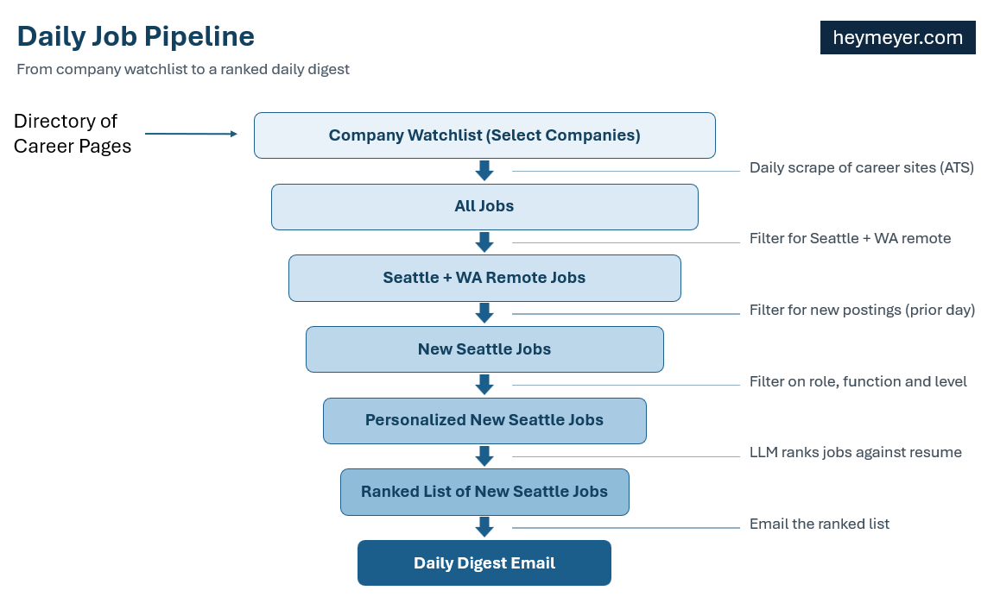

# Watchlist Jobs

**General Overview:** A daily job tracker for Seattle-area and remote-Washington roles. It scrapes public ATS boards (e.g. Greenhouse, Ashby, Lever, Workday) across hundreds of companies and surfaces ONLY new Seattle openings, filtered by personal criteria and ranked based on a resume.

  

**Technical Summary:** A Python loader pulls each company's live board once a day, normalizes the postings, and writes a dated snapshot to Supabase. Titles are auto-classified by discipline, role, and seniority level. A GitHub Actions cron job runs the loader daily.

----------------------------------------------------------------------------------------------------------

****Built with:** Claude Code (Primary) and Claud Chat + Gemini Pro  

**Data Sources:**
- **Company ATS and careers APIs:** Examples: Greenhouse, Ashby, Google, Eightfold/Microsoft, and Workday

**Tools & Infrastructure:**
- **Research**: Gemini Pro (Primary) | Claude (Secondary)
- **Coding:** Claude Code (Primary) | Claude Chat and Gemini Pro (Secondary)
- **Pipeline Testing:** Google Colab + Claude Chat 
- **Classification:** Excel + Claude => Regex  (LLM Rule Induction)  
- **Repo/Version Control:** Git and GitHub
- **Editor:** VS Code
- **Web scraping:** https://github.com/kalil0321/ats-scrapers/ - Open Source package/public repo
- **Storage & Schema Migration:** Supabase & Supabase CLI
- **Continuous Integration/Deployment:** GitHub Actions
- **Hosting:** GitHub Pages
- **Email:** Resend - WIP
- **LLM Scoring:** DeepSeek (V4 Flash, V4 Pro) and Claude (Sonnet 5) - WIP
- **Python libraries:** requests, httpx, html2text, openpyxl
- **Frontend libraries (via jsDelivr CDN):** Supabase JS client, DOMPurify, Chart.js, marked
